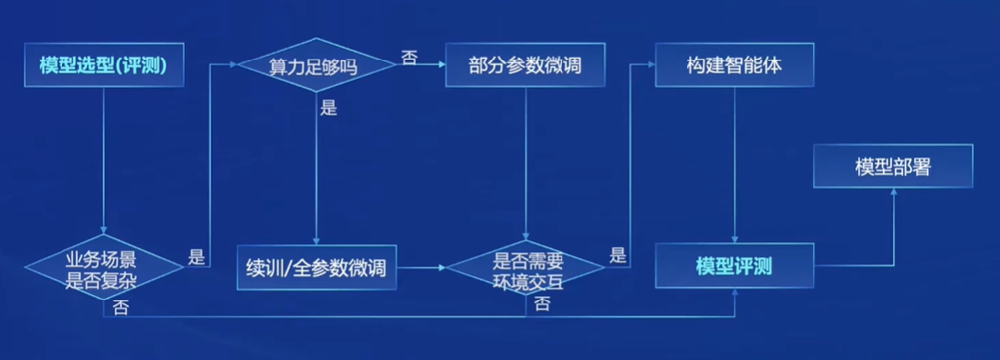
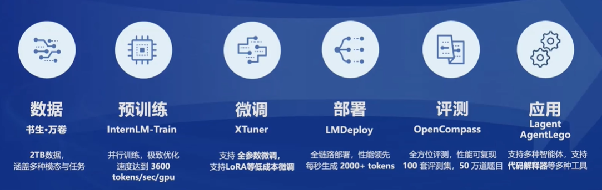

# 第一节课

## 大模型成为发展通用人工智能的重要途径

原因：大模型成为大家追逐的一个热点

## 三个模型版本

InternLM2-Base：模型基座

InternLM2：Base强化版，保持了很好的通用语言能力

InternLM2-Chat：经过SFT和RLHF，面向对话交互进行了优化，具有很好的指令遵循、共情聊天和调用工具等的能力

---

SFT：SFT（Scalable Fine-Tuning）是一种用于自然语言处理的技术，它通过对预训练的语言模型进行微调，使其适应特定任务。（待学习 [https://www.guyuehome.com/44305](https://www.guyuehome.com/44305)）

RLHF：RLHF（Reinforcement Learning from Human Feedback）（待学习 [https://blog.csdn.net/qq_35812205/article/details/133563158#2_RLHF_51](https://blog.csdn.net/qq_35812205/article/details/133563158#2_RLHF_51)）

## 从模型到应用典型流程

## 两种微调方式

### 增量续训

使用场景：让基座模型学习到一些新知识，如某个垂类领域知识

训练数据：文章、书籍、代码等

### 有监督微调

使用场景：让模型学会理解各种指令进行对话，或者注入少量领域知识

训练数据：高质量的对话、问答数据

分类：全量参数微调（全部调）、部分参数微调（固定一部分）

## 测评

CompassRank：中立全面的性能榜单

CompassKit：大模型评测全栈工具链

CompassHub：高质量评测基准社区

## 部署

基本没看懂，后面回来看。

## 智能体

### 概念

智能体（AIAgents或 Agents)，一般认为是一个可以通过行动能力自主完成设定的目标的代理。

可以根据用户给出的指令或设定的目标，感知观测环境状态，检索内置知识和感知经验记忆，对任务进行定义、分解和规划，形成并执行行动策略，反馈作用于目标环境。

大模型的智能体，通常指的是利用大模型作为核心大脑，通过任务规划、决策和执行复杂任务的智能体。

## 书生·浦语全链条开源开放体系

（后面再后顾）

## 总结

暂时看不懂很多概念，需要了解很多专有名词。
